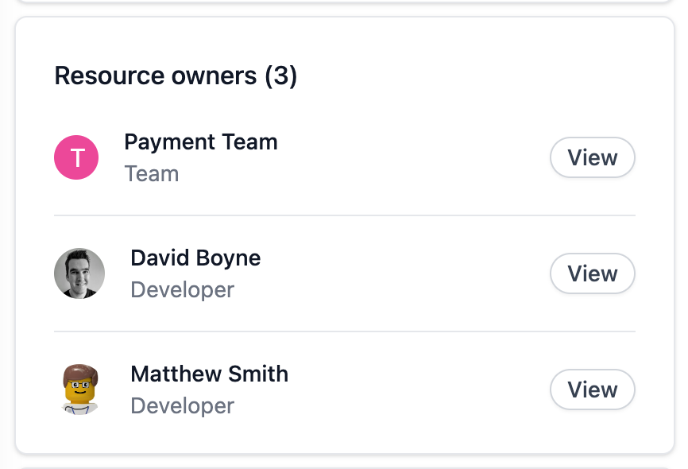

# Adding owners to resources

Resources can be assigned owners. Owners are either [users](/docs/overview/guides/users/introduction) or [teams](/docs/overview/guides/teams/introduction).

To add **owners** to your resource you can add the field **owners** to [your frontmatter](/docs/api/resource-front-matter#owners).

## Example

In the example below we have added three owners to this resource:

- dboyne (user)
- mSmith (user)
- payment-team (team)

```mdx
---
service: payment-service
description: Automates the sending of payment emails
name: Payment emails
AWS:
  Arn: >-
    arn:aws:lambda:us-west-2:1234567891234:function:payment-emails
  FunctionName: payment-emails
  MemorySize: 1024
  Runtime: nodejs16.x
  Handler: index.handler
  LastModified: 2022-11-22T10:55:10.000+0000
  CodeSize: 210432
  Service: lambda
  Account: 123245789
catalog:
  updatedAt: "2024-01-02T20:41:55.360Z"
  parent: lambda
  path: payment-emails
owners:
  - dboyne
  - mSmith
  - payment-team
---

### What does this function do?

The Lambda function is designed to streamline the process of sending payment emails in a highly efficient and automated manner. Once triggered, it meticulously gathers necessary payment details and recipient information from a designated data source. Utilizing this information, the function then dynamically generates personalized payment emails, ensuring that each message includes all relevant details such as payment amount, transaction ID, and due date. The emails are formatted for clarity and professionalism, adhering to predefined templates that maintain brand consistency. Upon successful generation, the Lambda function dispatches these emails to the respective recipients, providing them with timely and accurate payment notifications. This process not only enhances the speed and reliability of payment communications but also significantly reduces the manual effort required, thereby optimizing operational efficiency.
```

CloudCatalog will render the owners to the resource page when they are configured. Users can then explore users or teams directly from the resource page.


